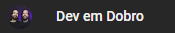

# Projeto Mario
Projeto desenvolvido durante a "semana do zero ao programador" oferecida pela equipe Dev em Dobro.

## Tecnologias utilizadas
- HTML
- CSS
- JavaScript

## Curiosidades e dificuldades
Este foi meu primeiro contato com as linguagens de tecnologia em sua aplicação direta, atráves deste projeto despertou uma antiga vontade de aprender programação e então migrar para área.

Não senti dificuldades acompanhando as aulas dos gêmeos, todas as etapas foram ensinadas de forma clara e objetiva, as dificuldades surgiram após o projeto, quando dei ínicio aos estudos e comecei a aprender. 

Tempo, atual emprego e minha família também se tornaram um grande desafio, saber concíliar tudo isso ao aprendizado de uma nova ideia.

